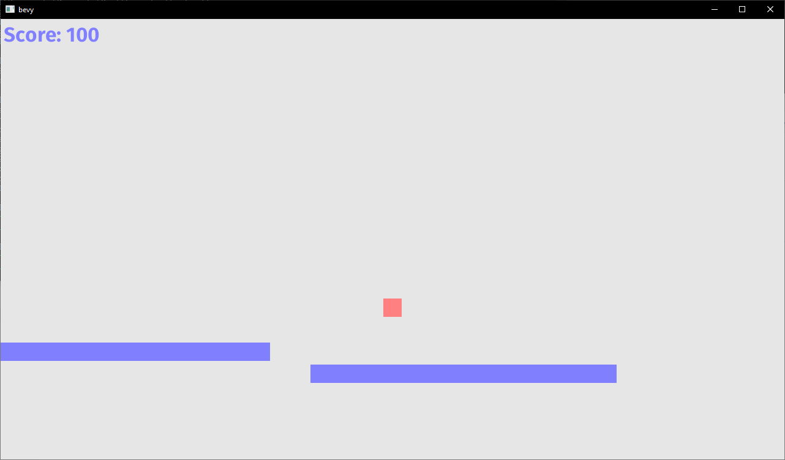

# bevy-test

Just a sandbox for testing out [Bevy](https://bevyengine.org/).

## Compilation

Follow instructions [here](https://bevyengine.org/learn/book/getting-started/setup/) to compile. Debug builds are compiled with the command `cargo run --features bevy/dynamic`. You will have to install the LLD linker and enable Nightly.

## Screenshot of Endless Runner:

